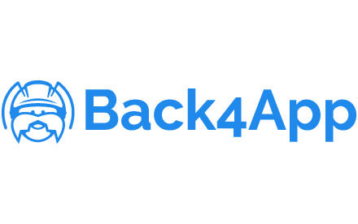

# convertendo-app-flutter-offline-para-online-2021-12-15
Como utilizar um backend as a service para transformar sua Aplicação Flutter offline em uma Aplicação Cloud Based.

# Convertendo uma Aplicação Flutter Offline para Cloud Based

Nessa aula vamos aprender a converter uma Aplicação `Flutter` utilizando um Backend as a Service, o [Back4app](https://www.back4app.com) para obter todos os recursos fundamentais de uma aplicação Cloud Based (escalabilidade, segurança, redundância e tolerância a falhas) de uma forma simples e produzindo pouco código.

Utilizaremos como base uma aplicação Flutter criada por [Abu Anwar](https://github.com/abuanwar072), o [Quiz-App-Flutter](https://github.com/abuanwar072/Quiz-App-Flutter), que é de código aberto e pode ser obtido (preferencialmente) via Github ou em arquivo ZIP contido neste projeto.

## Referências
- [Back4app](https://back4app.com)
- [Back4app Flutter - Documentação](https://www.back4app.com/docs/flutter/parse-sdk/parse-flutter-sdk)
- [Projeto Quiz-App-Flutter](https://github.com/abuanwar072/Quiz-App-Flutter)

## Expert

|  |
| :-: |
| [Alex Kusmenkovsky](https://github.com/alexvenom) |
